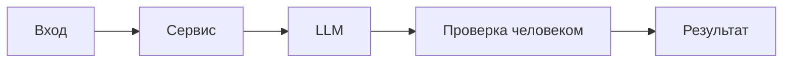

# ADR: решение для первого рабочего сценария

Файл ведёт OpenCode. Обсудите с агентом содержание и проверьте предложенный diff. Все дополнения и исправления поручайте агенту в чате.

- Статус: proposed / accepted
- Дата:
- Ответственные:

## Контекст

Нужна доказательная поддержка ревью PR по одному diff без доступа к коду и CI. Ответ должен быть структурирован и ограничен тремя рисками.
## Решение

Вводим master prompt с Context Pack, ограничивающий полномочия ассистента и требующий ссылок на файл/строку и проверяемых шагов. Ответ возвращается в структурированном формате.
## Рассмотренные альтернативы

| Альтернатива | Почему не выбрали сейчас |
|---|---|
| Полный доступ к репозиторию и запуск тестов | Противоречит учебной задаче «только diff» |
| Автоматическое исправление кода | Решение принимает человек, изменения кода вне рамок |

## Последствия и главный риск

- Положительные последствия:
  - Более воспроизводимые и проверяемые комментарии
- Ограничения:
  - Нет выполнения кода и команд; возможны ложные срабатывания без контекста
- Главный риск:
  - Ассистент будет делать голословные выводы
- Как проверим риск:
  - Сравнение P1-01 и P1-02 по доказательности и наличию проверок

## Архитектурная схема

## Как использовали AI

- Для чего:
- Тип промпта:
- Строка в [`prompts.md`](prompts.md):
- Что проверил студент и какие исправления поручил агенту:
