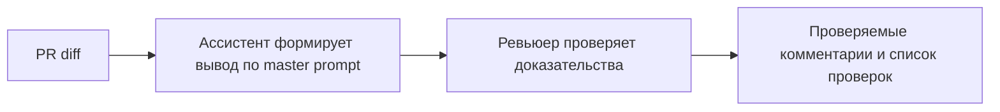

# Анализ процесса: AS IS и TO BE

Файл ведёт OpenCode. Обсудите с агентом содержание и проверьте предложенный diff. Все дополнения и исправления поручайте агенту в чате.

## AS IS

Ревьюер вручную читает diff, формулирует замечания в свободной форме. Часто отсутствуют ссылки на конкретные строки и воспроизводимые проверки.

## TO BE

Вводится мастер-промпт и Context Pack. Ассистент формирует структурированный вывод: краткое описание, до трёх рисков со ссылками и проверками. Ревьюер подтверждает или отклоняет предложения.

## Разница

| Что меняется | AS IS | TO BE | Как проверим изменение |
|---|---|---|---|
| Формат комментариев | Свободный текст | Структура с ссылками и проверками | Сравнение P1-01 vs P1-02 |
| Доказательность | Часто без подтверждений | Каждый риск с подтверждением | Доля утверждений с проверкой |
| Затраты времени | Больше времени на уточнения | Меньше за счёт структуры | Оценка ревьюером |

## Как использовали AI

- Для чего:
- Тип промпта:
- Строка в [`prompts.md`](prompts.md):
- Что проверил студент и какие исправления поручил агенту:
