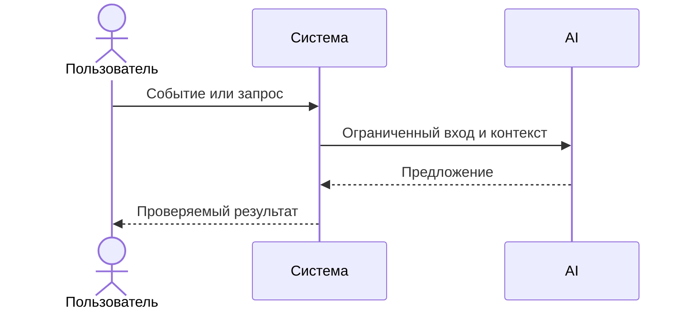

# Use cases и user stories

Файл ведёт OpenCode. Обсудите с агентом содержание и проверьте предложенный diff. Все дополнения и исправления поручайте агенту в чате.

## Первый рабочий сценарий

**Когда** ревьюер открывает PR и передаёт ассистенту diff, **система** возвращает краткое описание, до трёх рисков с ссылками и доказательствами и список проверок, **а пользователь получает** структурированные, проверяемые комментарии.

Не входит в этот сценарий:

- approve/merge PR, изменение кода, выполнение команд от имени ассистента

## Use case

| Поле | Значение |
|---|---|
| Актор | Ревьюер PR |
| Триггер | Появился diff и запрос ассистенту |
| Предусловия | Настроенная модель и мастер‑промпт |
| Основной результат | Структурированный отчёт: описание, риски со ссылками и проверками |
| Ошибка или отказ | Нет ссылок/проверок или превышено число рисков |



## User stories и acceptance criteria

```gherkin
Feature: Ревью PR ассистентом

  Scenario: Позитивный
    Given есть валидный unified diff PR
    When ассистент формирует отчёт по master prompt
    Then в ответе есть описание, ≤3 риска со ссылками и проверками, и список проверок

  Scenario: Негативный или граничный
    Given дифф неполный или отсутствуют ключевые части
    When ассистент не может подтвердить риски
    Then он запрашивает уточнение у человека или возвращает ограниченный результат без голословных утверждений
```

## Как использовали AI

- Для чего:
- Тип промпта:
- Строка в [`prompts.md`](prompts.md):
- Что проверил студент и какие исправления поручил агенту:
