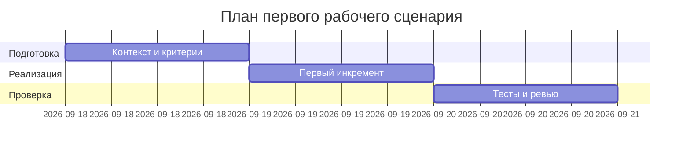

# План поставки

Файл ведёт OpenCode. Обсудите с агентом содержание и проверьте предложенный diff. Все дополнения и исправления поручайте агенту в чате.

## Инкременты и ответственность

| Инкремент | Наблюдаемый результат | Что делает человек | Что делает AI или субагент | Проверка | Зависимости |
|---|---|---|---|---|---|
| 1 | Запуск zero-shot и фиксация проблем | Выбор модели и запуск | Выполняет анализ diff без контекста | Файл results/P1-01.json, запись в prompts.md | Доступ к модели |
| 2 | Контекст и Master Prompt v1 | Подтверждает факты и ограничения | Собирает структуру и включит Context Pack | make step1 OK; наличие разделов | Результаты шага 1 |
| 3 | Запуск с master prompt | Сравнивает выводы | Повторный анализ по инструкции | Файл results/P1-02.json, сравнение в журнале | Готовый master prompt |

## Диаграмма Ганта

Передайте OpenCode даты и задачи своего плана и попросите обновить диаграмму.

## Как использовали AI

- Для чего:
- Тип промпта:
- Строка в [`prompts.md`](prompts.md):
- Что проверил студент и какие исправления поручил агенту:
